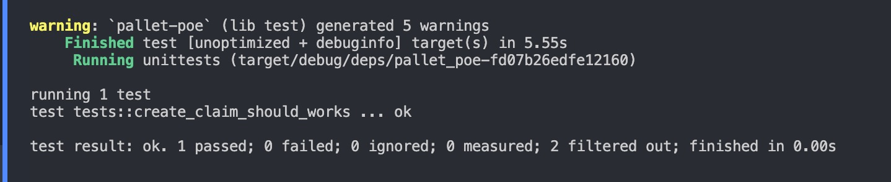
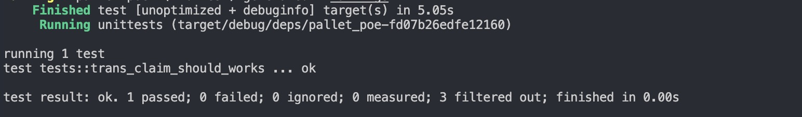

# 第五课作业 (源码在pallets/poe,runtime 已添加)


## 第一题 ：

#### 3个常用的宏：storage 宏，call 宏 ，event 宏

#### 3个常用存储： StorageValue StorageMap,StorageDoubleMap.


## 第二题

#### 创建存证：


```rust 

	/// storage and claim.
		#[pallet::weight(0)]
		pub fn create_claim(origin: OriginFor<T>, claim: Vec<u8>) -> DispatchResultWithPostInfo {
			let max_length = T::Length::get();

			ensure!(claim.len()  <= max_length as usize , Error::<T>::ClaimOverLength);

			let who = ensure_signed(origin)?;
			//check proofs if it's exist.
			ensure!(!Proofs::<T>::contains_key(&claim),Error::<T>::ProofAlreadyExist);

			//insert the claim
			Proofs::<T>::insert(&claim,(who.clone(),frame_system::Pallet::<T>::block_number()));

			Self::deposit_event(Event::ClaimCreate(who, claim));

			Ok(().into())
		}


```


#### 撤销存证：


```rust 

		#[pallet::weight(0)]
		pub fn revoked_claim(origin: OriginFor<T>, claim: Vec<u8>) -> DispatchResultWithPostInfo {

			let who = ensure_signed(origin)?;

			//check proofs if it's exist.
			let (owner,_) = Proofs::<T>::get(&claim).ok_or(Error::<T>::ClaimNotExist)?;

			//check owner
			ensure!(who == owner,Error::<T>::NotClaimOwner);

			//remove the key name claim
			Proofs::<T>::remove(&claim);

			Ok(().into())
		}


```


## 第三题

#### 添加可以转义存证：


```rust


		#[pallet::weight(0)]
		pub fn trans_claim(origin: OriginFor<T>, claim: Vec<u8> ,dest: T::AccountId) -> DispatchResultWithPostInfo {

			let who = ensure_signed(origin)?;

			//check proofs if it's exist.
			let (owner,_) = Proofs::<T>::get(&claim).ok_or(Error::<T>::ClaimNotExist)?;

			//check owner
			ensure!(who == owner,Error::<T>::NotClaimOwner);

			//insert the claim
			Proofs::<T>::insert(&claim,(dest.clone(),frame_system::Pallet::<T>::block_number()));

			Self::deposit_event(Event::ClaimTrans(who,dest, claim));

			Ok(().into())
		}


```


## 测试结果


###### create_claim_should_works

测试方法 ： create_claim_should_works





###### create_claim_error_by_already_exist

测试方法 ： create_claim_error_by_already_exist


###### trans_claim_should_works

测试方法 ： trans_claim_should_works





###### trans_claim_error_by_not_exist

测试方法 ： trans_claim_error_by_not_exist


###### trans_claim_error_by_not_claim_owner

测试方法 ： trans_claim_error_by_not_claim_owner


###### revoked_claim_should_works

测试方法 ： revoked_claim_should_works


###### revoked_claim_error_by_not_exist

测试方法 ： revoked_claim_error_by_not_exist


###### revoked_claim_error_by_not_claim_owner

测试方法 ： revoked_claim_error_by_norevoked_claim_error_by_not_claim_ownert_exist


## 第二题


###### create_claim_error_by_claim_over_length

测试方法 ： create_claim_error_by_claim_over_length


